<p align="center">
  
  
  
  
  
</p>

<p align="center">
  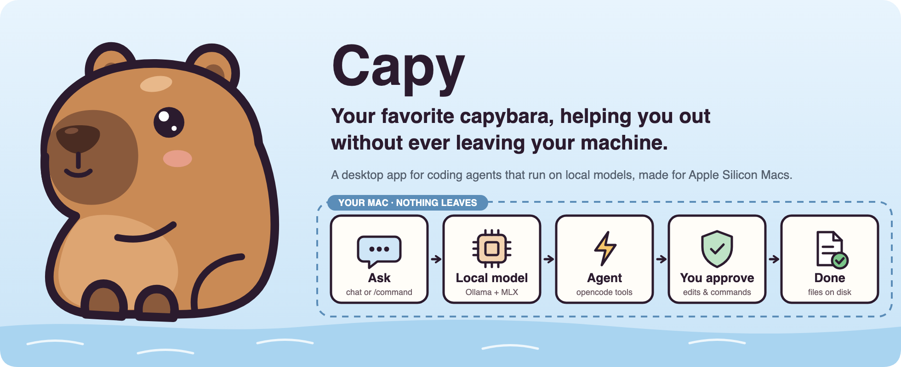
</p>

## What it is

**Capy is a desktop app for coding agents that run entirely on your Mac.**
Ask it to change code, explain a project or just chat. A capable agent reads your files,
plans, edits and runs commands, and asks before it touches anything. The model, the agent
and your data all stay on your machine.

Under the hood Capy bundles two open-source engines and makes them feel like one app:

- **[opencode](https://opencode.ai)** is the agent: sessions, tools, permissions, agents,
  skills, MCP servers and plugins.
- **[Ollama](https://ollama.com)** runs the model on Apple's **MLX** engine, the fastest
  way to run local models on Apple Silicon.

Capy starts and supervises both, wires them together, and surfaces every opencode setting
in a real settings screen, so you never touch a terminal or a JSON file unless you want to.
Nothing is sent to a cloud model provider; there isn't one configured.

## See it in action

<p align="center">
  <a href="assets/demo.mp4">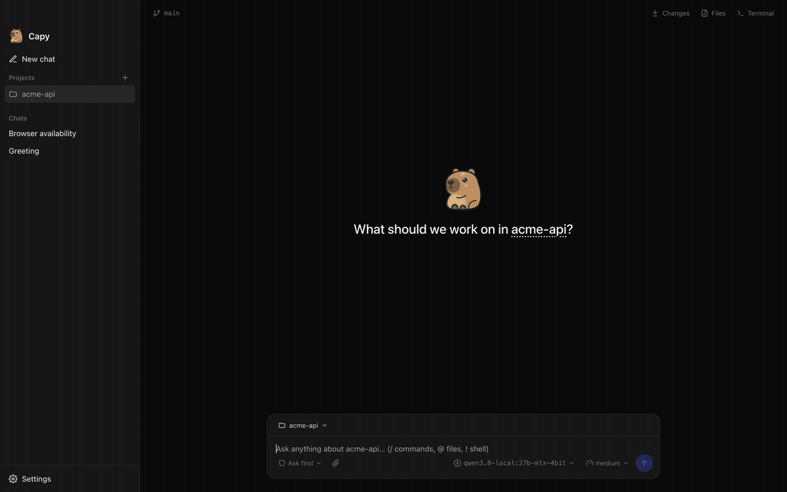</a>
</p>
<p align="center"><strong><a href="assets/demo.mp4">Open the video with pause and scrub controls</a></strong><br>
<sub>Real recording on an M5 Max running Qwen 3.8 27B (MLX, 4-bit) locally. Sped up 2×; waiting is trimmed.</sub></p>

**The example:** in a small git project, you ask Capy to *“plan this with your to-do list:
add a slugify(text) helper to src/utils.js, add a test for it, then run the tests.”* The
agent writes a to-do list, explores the project, and asks for approval before each edit and
before running `npm test`, ticking items off as it goes. It finishes with working code and
two passing tests, and the **Changes** panel shows exactly what it did, all without a byte
leaving the laptop.

<p align="center">
  <a href="#start">Start</a> ·
  <a href="#architecture">Architecture</a> ·
  <a href="#models-and-thinking">Models &amp; thinking</a> ·
  <a href="#settings">Settings</a> ·
  <a href="#develop">Develop</a>
</p>

## Start

Build and run it from source (signed releases are coming):

```sh
git clone https://github.com/giga-dylan/capy.git
cd capy
npm install      # also fetches the pinned Ollama + opencode builds
npm run dev
```

On first launch Capy starts its local services and asks you to pick a model. Download one
of the recommended models, any model from the Ollama library, or import one you already
have on disk (for example an MLX folder from LM Studio). Then just type:

> Help me understand how this project handles authentication.

There is no setup wizard and no account. Chats work without a folder; pick a project from
the folder button in the chat box when you want the agent to work on code.

| Choice | Where | What you decide |
| --- | --- | --- |
| Project | Folder button in the chat box | No folder, a recent project, or **Add folder…** |
| Model | Model picker in the chat box | Any installed model; switching is instant |
| Thinking | Thinking picker in the chat box | Only the levels the selected model supports |
| Mode | `/plan`, `/build` | Switch the chat between opencode's agents (and your own primary agents) |
| Goal | `/goal <objective>` | The agent keeps going across turns until the goal is met (`/pause_goal`, `/resume_goal`) |
| Side chat | **Side chat** button or `/side` | Ask about the current chat in a panel that never adds to it |
| Commands | Type `/` | Built-in, your own and skill commands, with Tab completion; `/compact` summarizes the chat |
| Files | Type `@`, the paperclip, or paste/drop | Mention project files or MCP resources; attach images for vision models |
| Shell | Start a message with `!` | Run a command directly in the chat's folder (`!git status`) |
| Access | Access picker in the chat box | **Ask first**, **Auto-approve** (work inside the project runs freely) or **Full access** (never asks) |
| Trust | Approval cards in the chat | Allow once, always allow, or deny each edit and command |

<p align="center">
  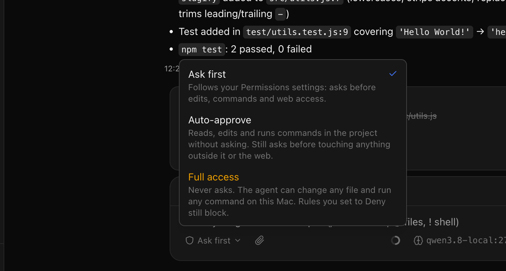
  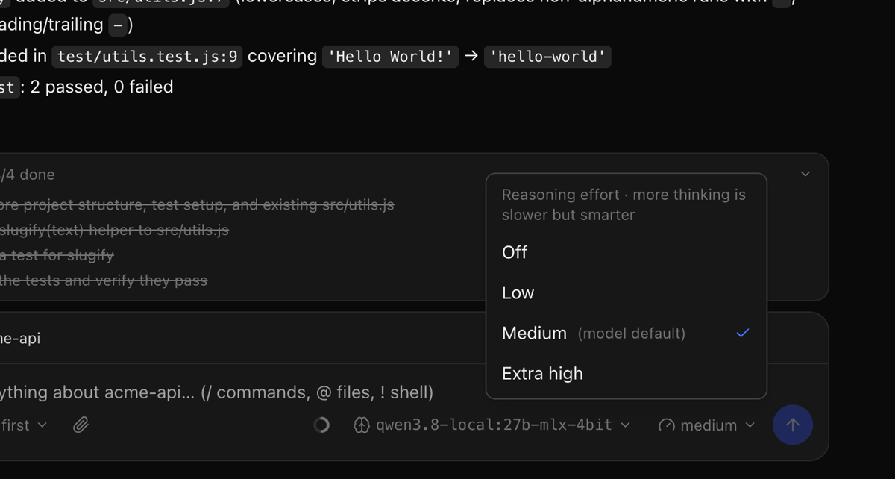
</p>

**Requirements:** an Apple Silicon Mac with **32 GB of memory or more** for the 27–30B
models (smaller models need less) and macOS 14 or later.

## Architecture


The window never talks to a model directly. The Electron main process starts both services
on random localhost ports, gives opencode a fresh password every launch, generates
opencode's config from your settings and installed models, and forwards live events
(streaming text, tool calls, approval requests) to the window.

| Component | Responsibility |
| --- | --- |
| Capy window | Chats, side chat, projects, approvals, pickers for model, thinking and access, settings |
| Electron main process | Service lifecycle, config generation, model downloads/imports, IPC |
| opencode (bundled) | Agent loop, tools, permissions, agents, commands, skills, MCP, plugins |
| Ollama (bundled) | Runs models on MLX; OpenAI-compatible API with tool calls and `reasoning_effort` |
| Private app data | `settings.json`, chats, rules, agents, skills, plugins, custom tools |

## Working with the agent

<p align="center">
  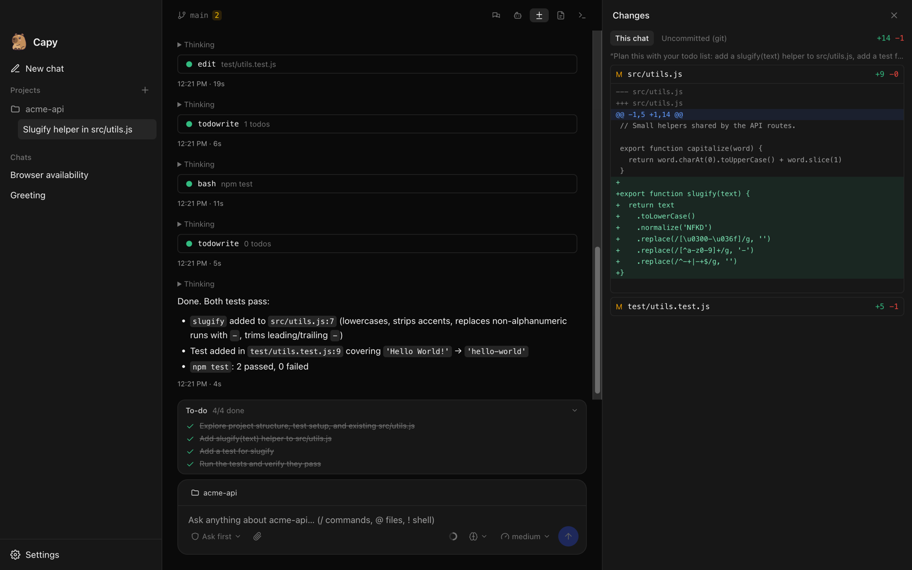
</p>

Next to each chat, a right-hand panel shows the **Side chat**, **Subagents**, **Changes**,
**Files** and **Terminal**.

<p align="center">
  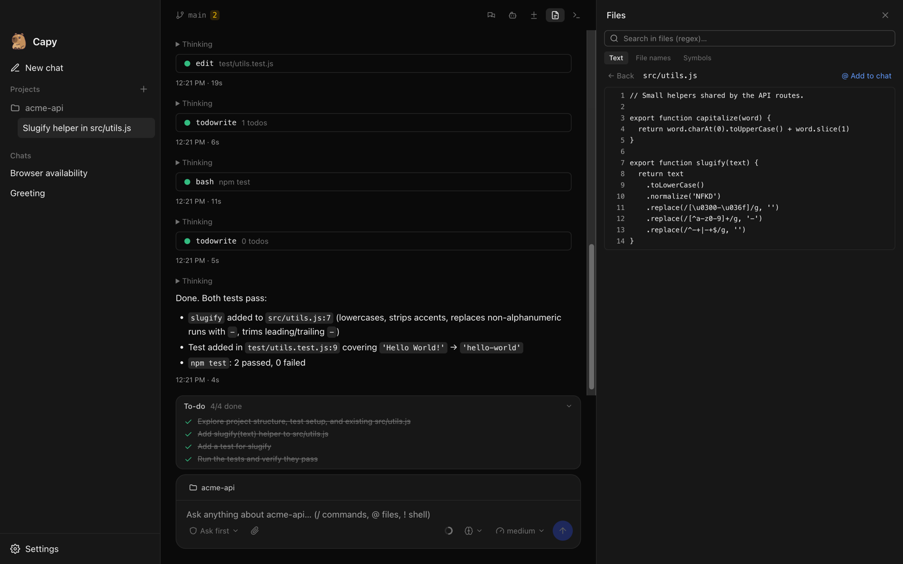
  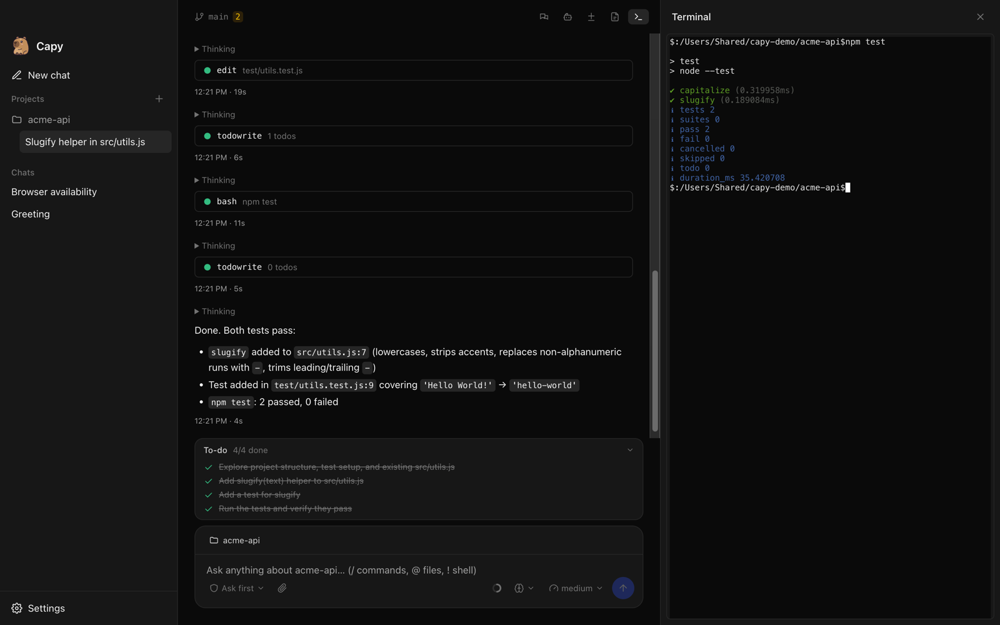
  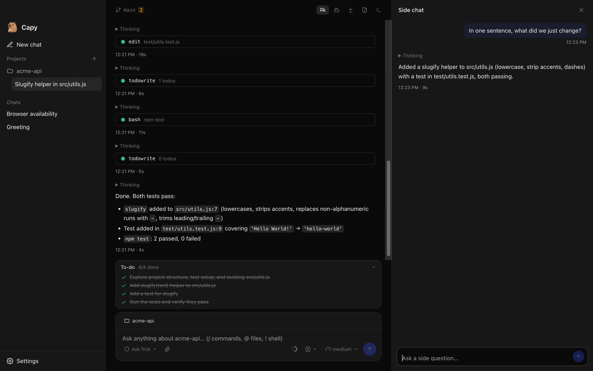
</p>

Everything here is a view over opencode's own API, so it behaves exactly like opencode does.

| Feature | Where | opencode API |
| --- | --- | --- |
| Markdown replies | Chat | Code blocks are highlighted and have a copy button |
| Message times | Under each message | When it was sent; replies also show how long they took |
| To-do list | Above the chat box while the agent works | `todo.updated`, `session.todo` |
| Undo / redo | Hover a message → undo; **Redo** in the banner | `session.revert`, `session.unrevert` (file snapshots) |
| Context meter | Ring in the chat box; click to compact | message token counts, `session.summarize` |
| Questions | Card in the chat when the agent asks you something | `question.asked`, `question.reply` |
| Side chat | **Side chat** button or `/side` | `session.fork` |
| Changes | **Changes** panel: per request, plus uncommitted git changes | `session.diff`, `vcs.diff` |
| Subagents | **Subagents** panel, or **Open subagent** on a task | `session.children` |
| Files and search | **Files** panel: tree, text/file-name/symbol search, “@ Add to chat” | `file.*`, `find.*` |
| Terminal | **Terminal** panel in the chat's folder | `pty.*` |
| Git | Branch and change count in the chat header | `vcs.get`, `vcs.status` |
| Worktrees | Folder picker → **New worktree**; listed under the project | `worktree.*` |
| Rename chats | Pencil (or double-click) in the sidebar | `session.update` |

## Models and thinking

Pick from a curated list, any [Ollama library](https://ollama.com/library) tag, or import an
MLX/safetensors folder or `.gguf` file. Models without tool support are flagged, because an
agent needs tools to do real work. A separate, smaller model can handle chat titles and
summaries.

**Thinking (reasoning effort) follows the model.** Capy reads each model's supported levels
from Ollama and offers only those. Ollama silently ignores levels a model doesn't support,
so guessing would mean a picker that does nothing. These were tested on real models:

| Model type | Example | Capy shows |
| --- | --- | --- |
| Named levels | Qwen 3.8 | Off · Low · Medium · Extra high |
| On/off | Qwen 3 | Off · On |
| Always thinks | DeepSeek-R1 | “Thinking: always on” (not adjustable) |
| No thinking | most instruct models | nothing |


## Settings

Everything opencode can do is surfaced in **Settings**, and each screen shows what's
actually loaded right now (built-in agents, skills, MCP status, formatters), not just
what's configured.

<p align="center">
  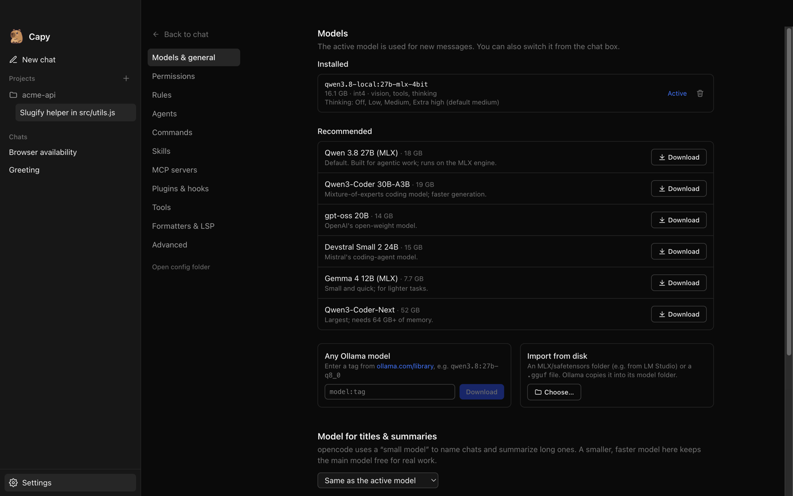
  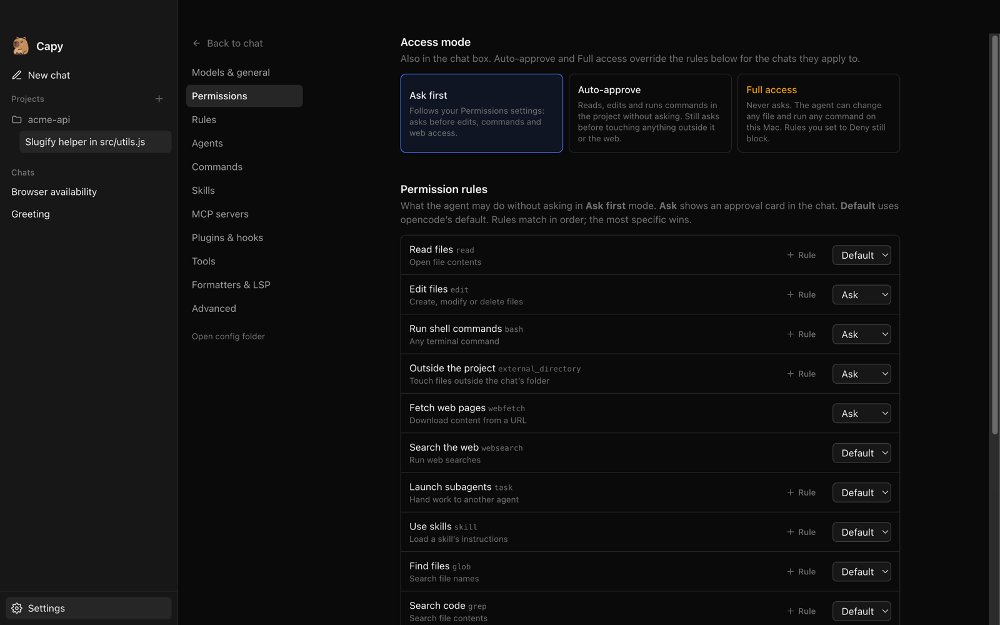
</p>
<p align="center">
  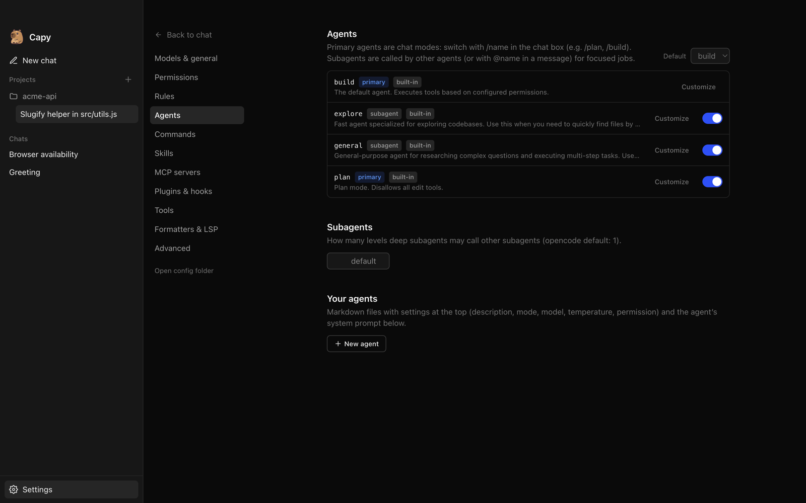
  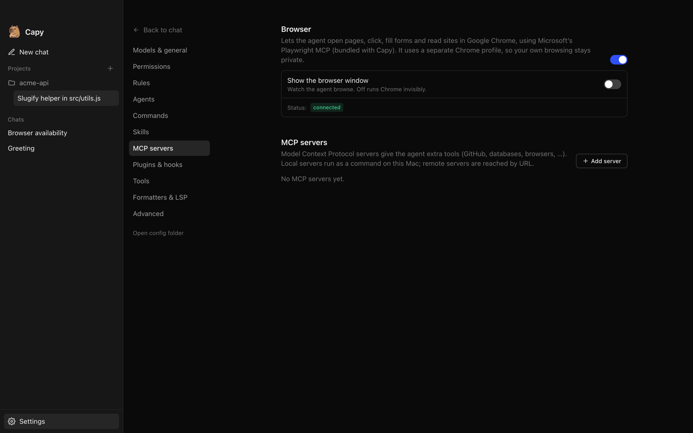
</p>

| Tab | What it covers |
| --- | --- |
| Models & general | Install, import, delete and switch models; title model; model folder; context and output limits |
| Permissions | Access mode (Ask first / Auto-approve / Full access), plus every opencode permission with ask / allow / deny and per-pattern rules |
| Rules | Global `AGENTS.md`, extra instruction files or URLs, optional `CLAUDE.md` loading |
| Agents | Built-in and custom agents, default agent, per-agent model/thinking/temperature/steps/prompt/permissions |
| Commands | Every command, plus your own `commands/*.md` (run as `/name args`) |
| Skills | Loaded skills by source, your own `SKILL.md` skills, extra folders and URLs |
| MCP servers | Built-in browser (on/off, show window), plus local or remote servers with env/headers, timeout, OAuth sign-in, resources and live status |
| Plugins & hooks | Goal mode toggle, plugin files with a hooks template (`tool.execute.before`, `session.idle`, …) and npm plugins |
| Tools | Turn any tool off; write your own tools in TypeScript |
| Formatters & LSP | Turn formatters and language servers on, per tool, plus custom ones |
| Advanced | Compaction, tool output and image limits, shell, log level, watcher, references, experimental flags, raw JSON |

Every screen edits one JSON layer that is merged over the config Capy generates, so the
raw editor in **Advanced** and the forms never disagree. Saving restarts the agent engine
in about a second; switching model, thinking or agent doesn't.

## Capabilities and limits

- **Local models are smaller than frontier models.** Expect good results on focused tasks
  and slower, less reliable ones on sprawling changes. Qwen 3.8 27B on an M5 Max generates
  ~30 tokens/s and reads a 16K-token prompt at ~930 tokens/s.
- **Memory decides the model.** 27–30B models need about 32 GB; the first load of a model
  from a slow external drive can take ~40 s.
- **Approvals are on by default.** File edits, shell commands, web fetches and access
  outside the chat's folder all ask first. Relax them per pattern, or switch the access
  mode: **Auto-approve** lets work inside the project run freely, and **Full access** never
  asks. A switch applies instantly, even to a task that's already running.
- **Browser use** runs Microsoft's Playwright MCP (bundled) in Google Chrome with a separate
  Chrome profile; Chrome must be installed. It's an ordinary MCP server in opencode's config.
- **Goal mode isn't in opencode itself.** Capy enables the
  [opencode-goal-plugin](https://github.com/prevalentWare/opencode-goal-plugin) through
  opencode's plugin system (toggle in Plugins & hooks); it installs from npm on first start.
- **Side chat** forks the chat with opencode's own `session.fork` and runs the read-only plan
  agent. opencode 2.0 adds a native `/btw`; Capy will switch to it when 2.0 ships.
- **Internet only when you ask.** Model downloads, web fetch/search tools you allow, and
  MCP servers you add are the only network use. Chat sharing and auto-update are off.
- **Claude Code compatibility is off.** opencode can load `~/.claude/skills` and
  `CLAUDE.md`; Capy disables that by default so it only uses what's configured in Capy.
  Toggle it in Skills and Rules.
- **macOS on Apple Silicon only** for now.

## Private state and storage

| What | Where |
| --- | --- |
| App settings and the opencode config layer | `~/Library/Application Support/Capy/settings.json` |
| Rules, agents, commands, skills, plugins, tools | `~/Library/Application Support/Capy/opencode/config/opencode/` |
| Chats | `~/Library/Application Support/Capy/opencode/data/` |
| No-folder chat workspace | `~/Library/Application Support/Capy/chats/` |
| Models | `~/.ollama/models` (shared with Ollama), or a folder you choose |

Capy keeps its own opencode folders, so it never collides with an opencode you've
installed yourself. **Open config folder** in Settings jumps straight there.

## Develop

```sh
npm install          # dependencies + pinned Ollama/opencode builds in resources/bin
npm run dev          # run with hot reload
npm run typecheck
npm run dist         # signed + notarized arm64 DMG/zip in dist/
```

Pinned runtime versions live in `package.json` → `"binaries"`; bump them together with
`@opencode-ai/sdk` and `opencode-darwin-arm64`, then run `npm run fetch-binaries`.
Release builds need a Developer ID certificate plus `APPLE_ID`,
`APPLE_APP_SPECIFIC_PASSWORD` and `APPLE_TEAM_ID`.

```
src/main/       Electron main: services (ollama.ts, opencode.ts), settings, extensions, IPC
src/preload/    The window.api bridge
src/renderer/   React UI: chat, sidebar, pickers, settings/
src/shared/     Types shared by both sides
assets/         README images and demo
```

---

[opencode docs](https://opencode.ai/docs/) · [Ollama](https://ollama.com) ·
[Architecture](#architecture) · [Settings](#settings)
